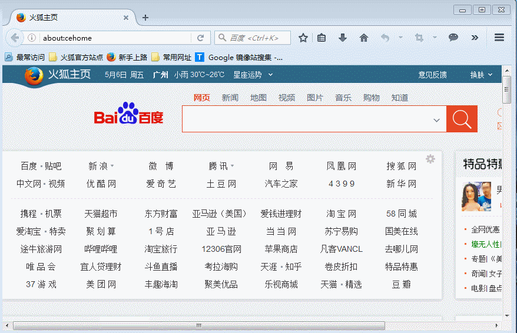

- [README](#readme)
  - [Installation](#installation)
  - [Configuration](#configuration)
    - [Config org-capture and org-capture-pop-frame](#config-org-capture-and-org-capture-pop-frame)
    - [Config firefox](#config-firefox)

# README

org-capture-pop-frame is an extension of org-capture, when it is enabled,
org-capure will capture things in a new pop frame, after capture finish or abort.
the poped frame will be delete.

NOTE:

1.  This extension is suitable for capturing links and text in firefox.
2.  You can click with mouse in emacs header-line to finish or abort capture.

## Installation

org-capture-pop-frame is now available from the famous emacs package repo
[melpa](http://melpa.milkbox.net/), so the recommended way is to install it
through emacs package management system.

## Configuration

### Config org-capture and org-capture-pop-frame

    (require 'org-capture)
    (require 'org-capture-pop-frame)
    (setq org-capture-templates
          '(("f" "org-capture-from-web" entry  (file+headline "~/note.org" "Notes-from-web")
             "** %a

    %i
    %?
    "
             :empty-lines 1)))

### Config firefox

You need install **one** of the following firefox extensions, then config it.

1.  AppLauncher
    1.  Download links
        1.  <https://addons.mozilla.org/zh-CN/firefox/addon/applauncher/?src=api>
        2.  <https://github.com/nobuoka/AppLauncher>
    2.  Applauncher config
        1.  Name: org-capture(f) (Edit it)
        2.  Path: /home/feng/emacs/bin/emacsclient (Edit it)
        3.  Args: org-protocol://capture://f/&eurl;/&etitle;/&etext; ("f" is org-capture's key)
2.  org-mode-capture

    1.  Download links
        1.  <https://addons.mozilla.org/fr/firefox/addon/org-mode-capture/>
        2.  <http://chadok.info/firefox-org-capture>
        3.  <https://github.com/tumashu/firefox-org-capture> (tumashu modify version)
    2.  Config it (Very simple, just change emacsclient path.)

    NOTE: The official org-mode-capture extension can not set some emacsclient options,
    for example: "&#x2013;socket-name", you can download and install tumashu's modify [org-mode-capture's xpi](https://github.com/tumashu/firefox-org-capture/blob/master/org-capture-0.3.0.xpi?raw=true)
    instead.
